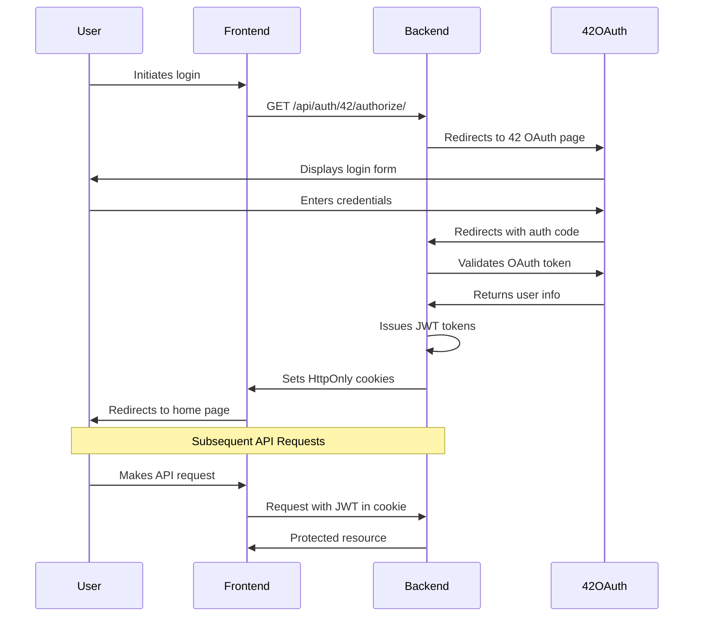

# Authentication API

The authentication API handles user authentication and authorization.

## Endpoints

### OAuth Authentication

#### GET `/api/auth/42/authorize/`

Redirects the user to the 42 OAuth authorization page.

#### GET `/api/auth/42/callback/`

Handles the OAuth callback from 42 and sets authentication cookies.

**Query Parameters:**

- `code`: OAuth authorization code

**Response:**

- Redirects to the home page on success
- Redirects to login page with error on failure

### JWT Token Management

#### POST `/api/auth/token/refresh/`

Refreshes the access token using the refresh token.

**Request:**
No body required, uses the refresh token cookie.

**Response:**

```json
{
  "access": "new.access.token"
}
```

## Authentication Flow

