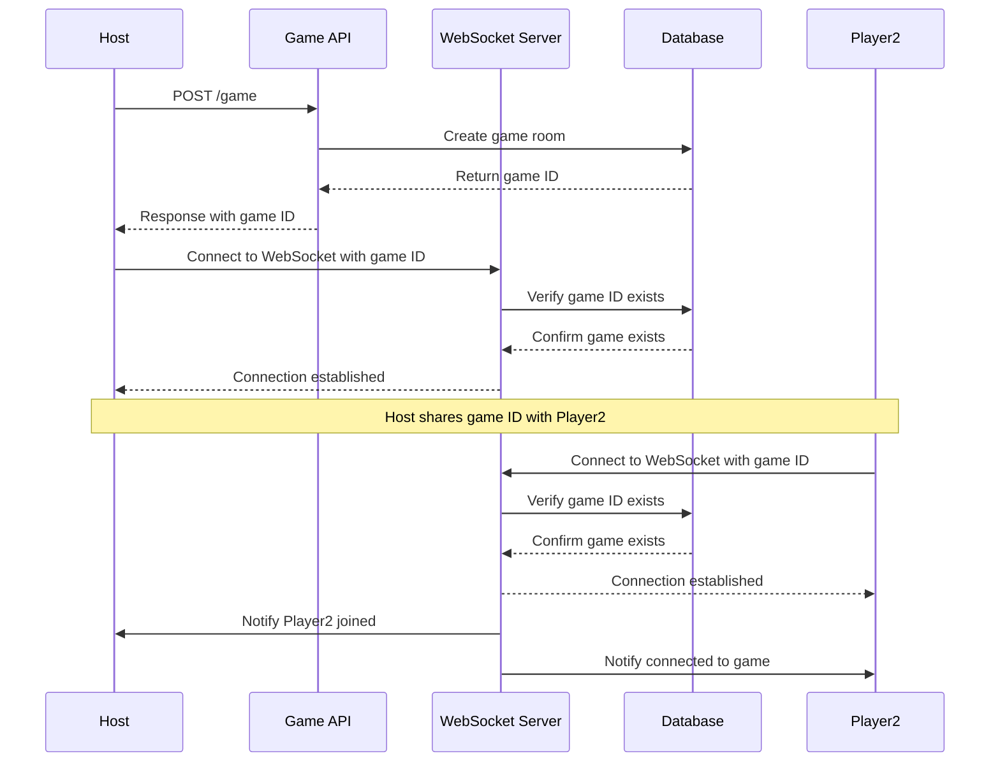

# Game API

## Game Flow

```mermaid
sequenceDiagram
    participant Host
    participant API as Game API
    participant WS as WebSocket Server
    participant DB as Database
    participant Player2

    Host->>API: POST /game
    API->>DB: Create game room
    DB-->>API: Return game ID
    API-->>Host: Response with game ID

    Host->>WS: Connect to WebSocket with game ID
    WS->>DB: Verify game ID exists
    DB-->>WS: Confirm game exists
    WS-->>Host: Connection established

    Note over Host,Player2: Host shares game ID with Player2

    Player2->>WS: Connect to WebSocket with game ID
    WS->>DB: Verify game ID exists
    DB-->>WS: Confirm game exists
    WS-->>Player2: Connection established
    
    WS->>Host: Notify Player2 joined
    WS->>Player2: Notify connected to game
```