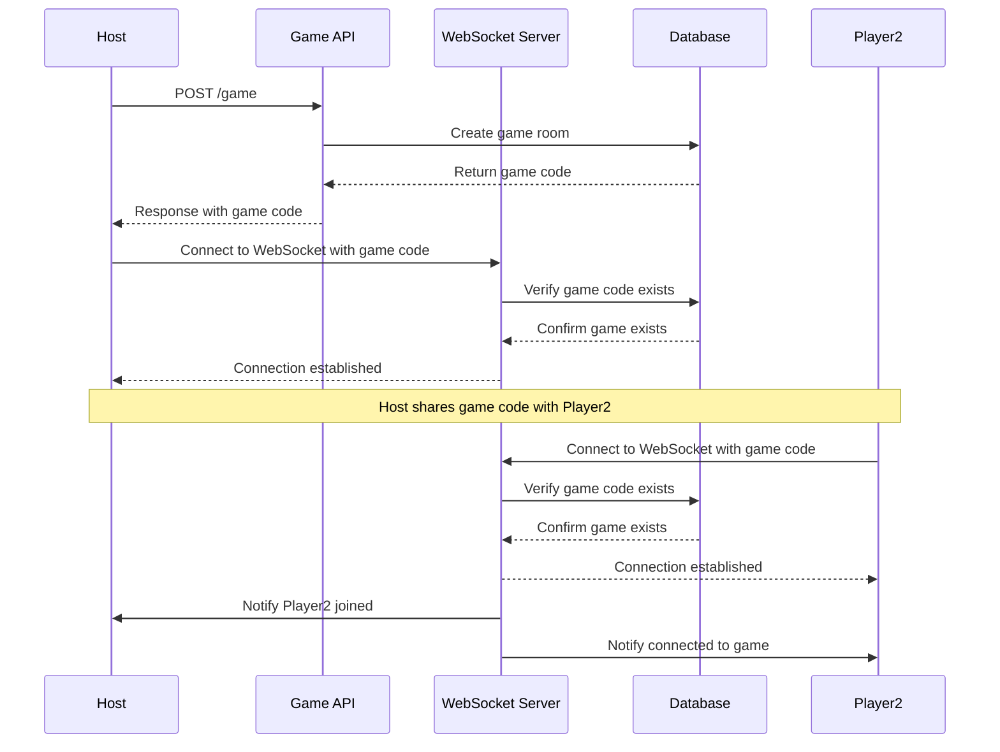
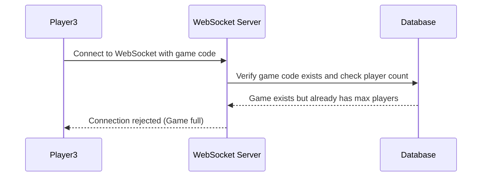
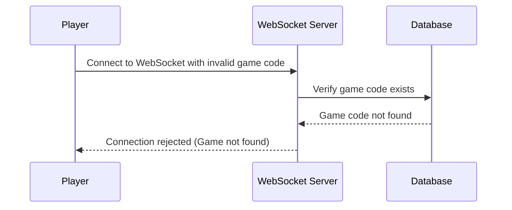
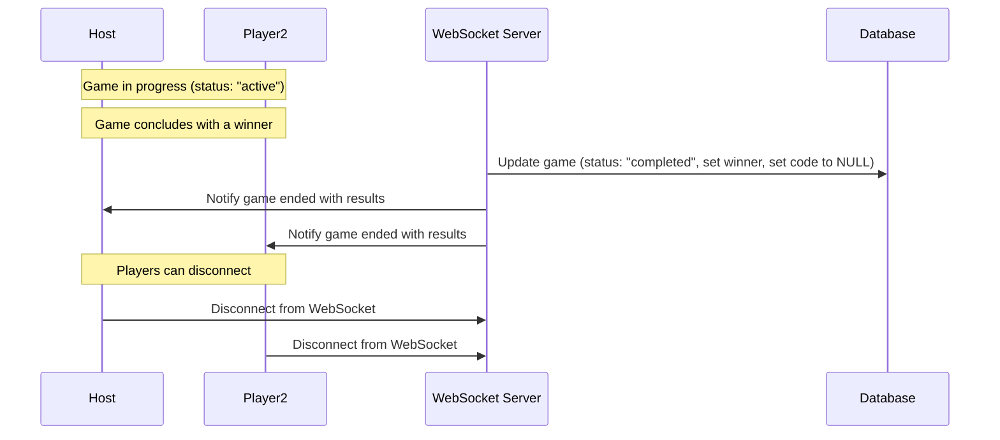
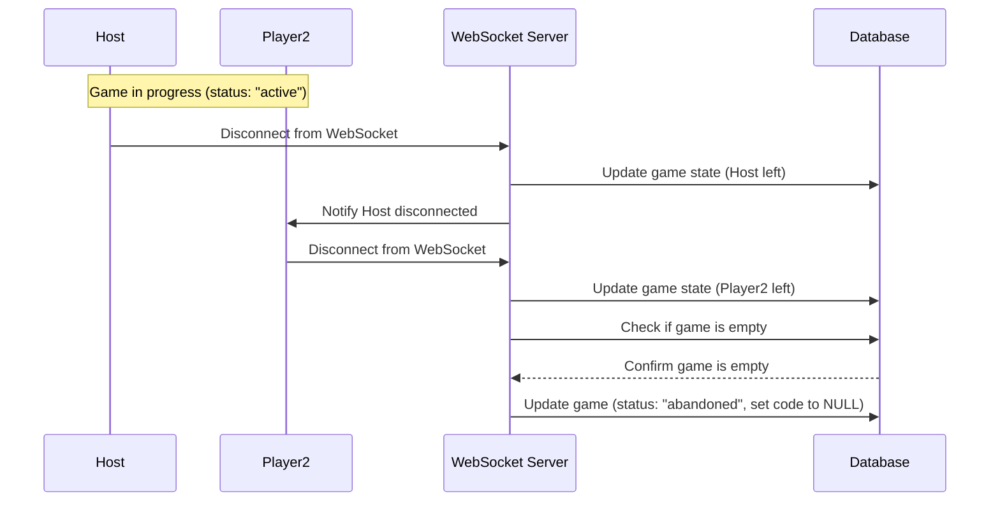

# Game API

## Game Flow

### Standard Flow

This diagram shows the standard flow for creating and joining a game. The game record is stored in the games table with a unique "code" field for joining and status "waiting" initially, then "active" when Player2 joins.

### Edge Cases

#### Case 1: The game is full

When a third player attempts to join a game that already has the maximum number of players (2), the connection is rejected.

#### Case 2: The Game doesn't exist

When a player attempts to join a game with an invalid game code, the connection is rejected. This prevents connections to non-existent game rooms.

#### Case 3: Game Completion

When a game completes normally with a winner, the game code is set to NULL but the record remains in the database with the game results and winner information.

#### Case 4: All Players Leave the Game Prematurely

When all players disconnect from an active game, the game is marked as abandoned but remains in the database with its code set to NULL.

