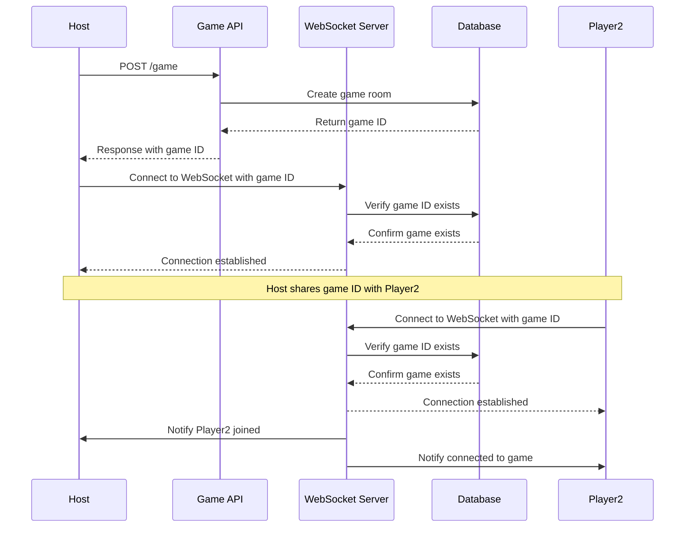
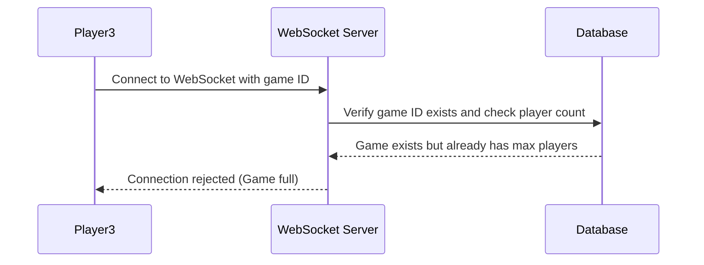
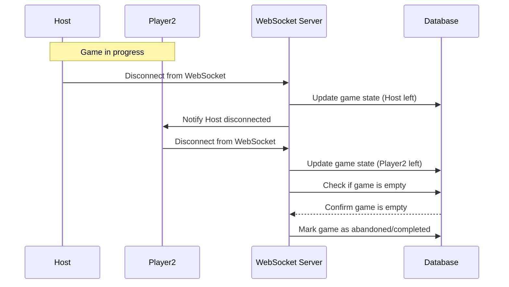

# Game API

## Game Flow

### Standard Flow

This diagram shows the standard flow for creating and joining a game. The game record is stored in the games table with status "waiting" initially, then "active" when Player2 joins.

### Edge Cases

#### Case 1: The game is full

When a third player attempts to join a game that already has the maximum number of players (2), the connection is rejected. The game remains in the games table with status "active".

#### Case 2: The Game doesn't exist

When a player attempts to join a game with an invalid ID, the connection is rejected. This prevents connections to non-existent game rooms.

#### Case 3: The Game is abandoned

When all players disconnect from the game, the game is considered abandoned. The game data is moved from the games table to the game_history table with status "abandoned", freeing up the game ID for future use. Game statistics and player information are preserved in the history record.

#### Case 4: The Game is completed

When the game is completed, the game data is moved from the games table to the game_history table with status "completed". The game statistics and player information are preserved in the history record.
