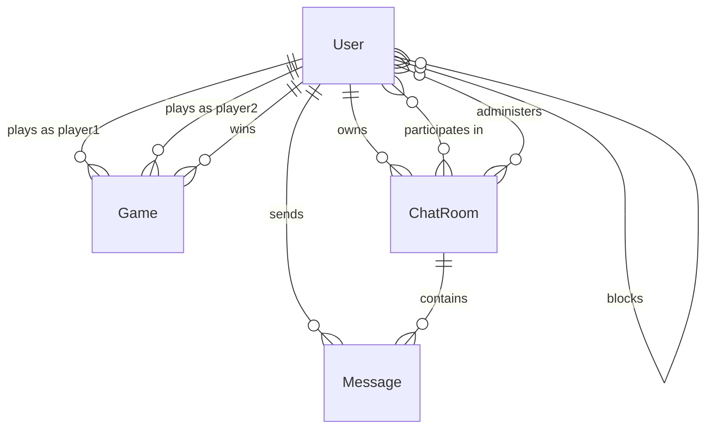

# Database Schema

This document outlines the database schema for ft_transcendence. All data is stored in a PostgreSQL database.

## Key Models

!!! note "Django ORM"
    We use Django's Object-Relational Mapping (ORM) to define and interact with our database models.

### User Model

The extended Django user model with additional fields for our application.

```python
class User(AbstractUser):
    """Extended user model with additional fields for ft_transcendence."""

    # OAuth and authentication
    intra_id = models.CharField(max_length=100, unique=True, null=True, blank=True)
    avatar = models.ImageField(upload_to='avatars/', null=True, blank=True)
    two_factor_enabled = models.BooleanField(default=False)

    # Social features
    friends = models.ManyToManyField('self', symmetrical=True, blank=True)
    blocked_users = models.ManyToManyField('self', symmetrical=False, blank=True, related_name='blocked_by')

    # Game statistics
    wins = models.IntegerField(default=0)
    losses = models.IntegerField(default=0)
    rank = models.IntegerField(default=0)

    def __str__(self):
        return self.username
```

### Game Model

Stores information about completed games.

```python
class Game(models.Model):
    """Model representing a completed game."""

    player1 = models.ForeignKey(User, on_delete=models.CASCADE, related_name='games_as_player1')
    player2 = models.ForeignKey(User, on_delete=models.CASCADE, related_name='games_as_player2')
    player1_score = models.IntegerField()
    player2_score = models.IntegerField()
    winner = models.ForeignKey(User, on_delete=models.CASCADE, related_name='games_won')
    created_at = models.DateTimeField(auto_now_add=True)

    def __str__(self):
        return f"{self.player1.username} vs {self.player2.username} ({self.player1_score}-{self.player2_score})"
```

### Chat Models

Chat rooms and messages.

```python
class ChatRoom(models.Model):
    """Model representing a chat room."""

    name = models.CharField(max_length=100)
    is_private = models.BooleanField(default=False)
    password = models.CharField(max_length=128, null=True, blank=True)  # Hashed password
    owner = models.ForeignKey(User, on_delete=models.CASCADE, related_name='owned_rooms')
    admins = models.ManyToManyField(User, related_name='admin_rooms', blank=True)
    participants = models.ManyToManyField(User, related_name='chat_rooms', blank=True)
    banned_users = models.ManyToManyField(User, related_name='banned_from', blank=True)
    created_at = models.DateTimeField(auto_now_add=True)

    def __str__(self):
        return self.name

class Message(models.Model):
    """Model representing a chat message."""

    room = models.ForeignKey(ChatRoom, on_delete=models.CASCADE, related_name='messages')
    sender = models.ForeignKey(User, on_delete=models.CASCADE, related_name='sent_messages')
    content = models.TextField()
    created_at = models.DateTimeField(auto_now_add=True)

    def __str__(self):
        return f"{self.sender.username}: {self.content[:20]}"
```

## Entity Relationship Diagram



## Database Migrations

We use Django migrations to manage changes to the database schema. All migrations are stored in the `migrations` directory of each app.

To create new migrations:

```bash
make create migrations app_name
```

To apply migrations:

```bash
make migrate
```
