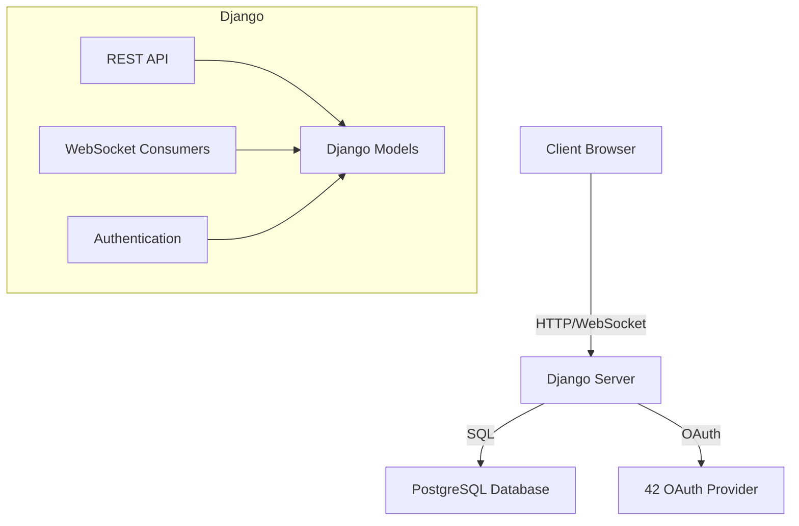

# Architecture Overview

ft_transcendence is a real-time multiplayer Pong game web application featuring:

- User authentication (including OAuth with 42)
- Social features
- Real-time multiplayer gameplay

!!! info "Project Requirements"
    This project is based on 42 School's ft_transcendence subject. All code must comply with the requirements outlined in the [subject document](../requirements.md).

## Project Structure

```
ft_transcendence/
├── transcendence/      <-- Core Django project configuration
├── apps/               <-- Django applications
├── docs-site/          <-- Project documentation
├── static/             <-- Static files
├── templates/          <-- Django templates
└── docker/             <-- Docker configuration files
```

## Tech Stack

- **Backend**: Django with Django REST Framework
- **Frontend**: Custom Single Page Application (SPA) with vanilla JavaScript
- **Database**: PostgreSQL
- **Real-time**: Django Channels for WebSocket support
- **Authentication**: OAuth 2.0 integration with 42

!!! tip "Why Vanilla JavaScript?"
    The project requirements specify that we cannot use frontend frameworks like React or Vue.js. Our custom SPA implementation provides similar functionality using vanilla JavaScript.

## High-Level Architecture

The application follows a client-server architecture:

1. **Backend**: Django REST API serves data and handles business logic
2. **Frontend**: Custom SPA handles UI rendering and user interactions
3. **Database**: PostgreSQL stores application data
4. **WebSockets**: Real-time communication for game and chat features

See [Backend Architecture](backend.md) and [Frontend Architecture](frontend.md) for more details.

## System Diagram


