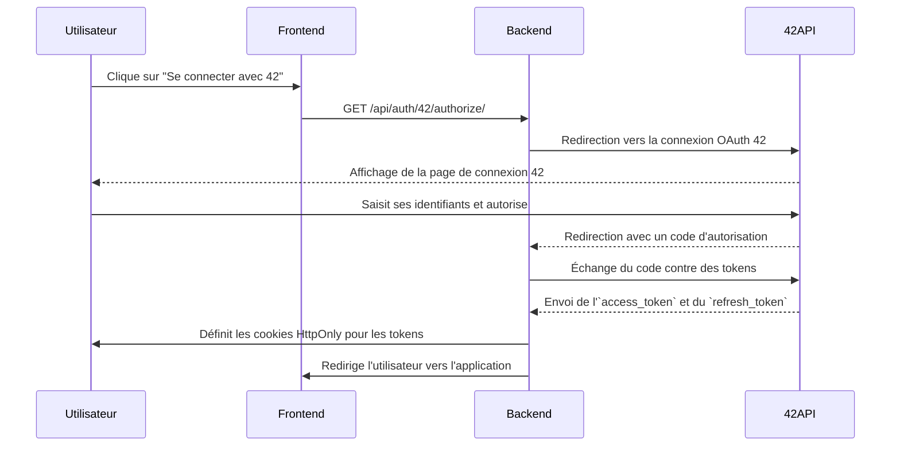
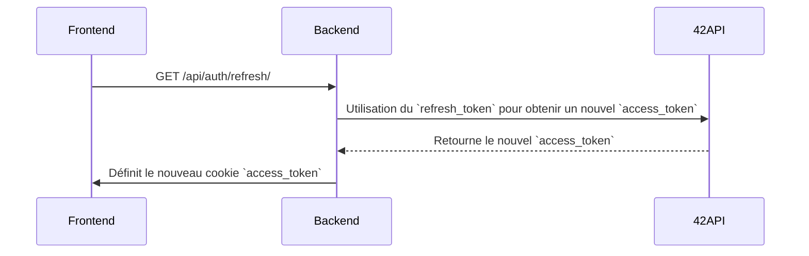
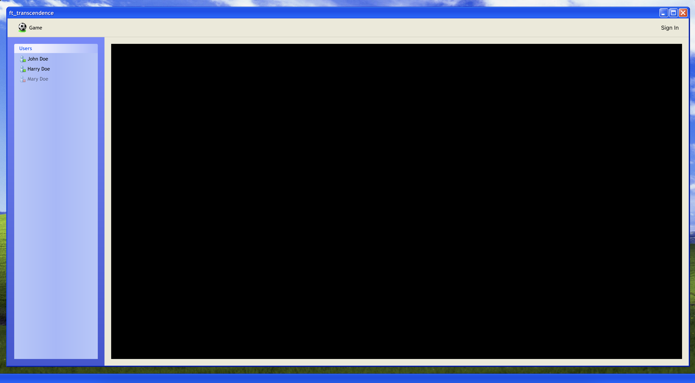
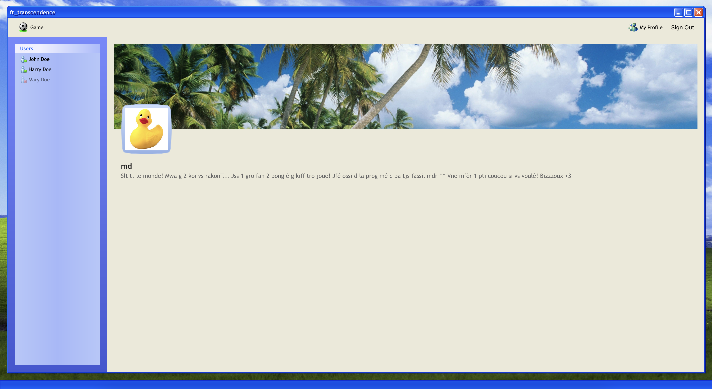

# Changelog du 24/04/2025

## Mises à jour du Backend

### Documentation

J’ai ajouté une documentation pour les routes de l’API.

Rendez vous sur `<url>/api/docs` pour accéder à la documentation.

### Authentification

J’ai implémenté l’authentification 42 en utilisant OAuth2.0 avec trois nouveaux points d’API :

- `GET /api/auth/42/authorize/` redirige les utilisateurs vers le portail d’authentification de 42.
- `GET /api/auth/42/callback/` gère la réponse de 42 et définit access_token et refresh_token en tant que cookies HttpOnly.
- `GET /api/auth/refresh/` rafraîchit l’access_token en utilisant le refresh_token.

#### Flux d’Authentification



Les tokens sont stockés dans des cookies HttpOnly pour des raisons de sécurité. L’access_token est de courte durée et utilisé pour les requêtes API, tandis que le refresh_token permet d’obtenir un nouvel access_token.

#### Flux de Rafraîchissement des Tokens



## Mises à jour du Frontend

Un nouveau design inspiré de Windows XP a été appliqué, intégrant des améliorations basées sur les modifications d’Hortense. Cela inclut des mises à jour de la page du jeu, de la page de profil, des boutons de connexion et de déconnexion, ainsi que de la liste des utilisateurs. Ces composants doivent maintenant être connectés au backend.




### Fichiers Statiques

Les fichiers statiques sont maintenant servis depuis le dossier `/static` à la racine du projet.
Exemple : `/static/images/logo.png` est accessible via `<url>/static/images/logo.png`.
Toutes les références aux fichiers statiques doivent être mises à jour en conséquence.

#### Exemple

```html
<!-- avant -->

<!-- après -->

```

> N’oubliez pas le préfixe `/static`, il est obligatoire.

### Classe `Page`

#### Feuille de Style

La classe `Page` accepte désormais un fichier CSS en paramètre :

```javascript
import { Page } from '../core/Page.js';

export class GamePage extends Page {
  constructor() {
    // template: /static/html/pages/game.html
    // stylesheet: /static/css/pages/game.css
    super('game.html', 'game.css');
  }
}
```

Toutes les pages peuvent désormais passer leur fichier CSS correspondant lors de l’instanciation de `Page`.

Ce fichier CSS sera chargé automatiquement lorsque la page sera montée depuis le dossier `/static/css/pages`.

#### onMount

J’ai ajouté une nouvelle méthode `onMount` à la classe `Page`. Cette méthode est appelée lorsque la page est montée (affichée).

```javascript
class GamePage extends Page {
  constructor() {
    super('game.html', 'game.css');
  }

  onMount() {
    // Cette méthode est appelée lorsque la page est montée.
    // Elle est utilisée pour bind les events, initialiser la page, etc.
    console.log('Game Page mounted');
  }
}
```

## Prochaines Étapes

Le frontend doit implémenter la logique d’authentification en utilisant les nouvelles routes.

Toutes les pages doivent référencer correctement les fichiers statiques, et les pages restantes doivent suivre la nouvelle structure de la classe `Page`.
